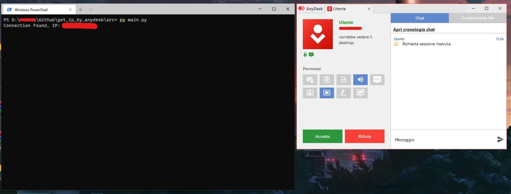

# Get IP By Anydesk
Get IP of someone whoose trying to connect to your monitor with anydesk (Windows only at the moment). 
>For download the dependecies run `py -m pip install -r requirements.txt`
>For run the script type  `py main.py` when someone just tried to connect to your monitor.

