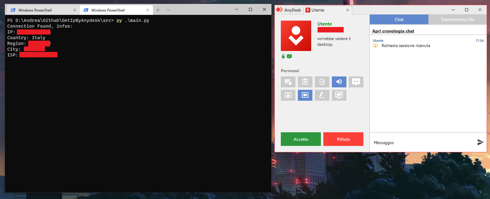

# Get IP By Anydesk
*Get IP of someone whoose trying to connect to your monitor with anydesk (Microsoft Windows only at the moment).*
>You can run the program before open anydesk.

## Download Tutorial [git needed]
1. `git clone https://github.com/Pari030/GetIpByAnydesk`
1. `cd GetIpByAnydesk`
1. `py -m pip install -r requirements.txt`
1. `py main.py`

## Features
- [x] **Automatic waiting and retry until anyone connect to your minitor.**
- [x] **Automatic get IP information.**
- [ ] **Compatible with linux**

# Example Photo

